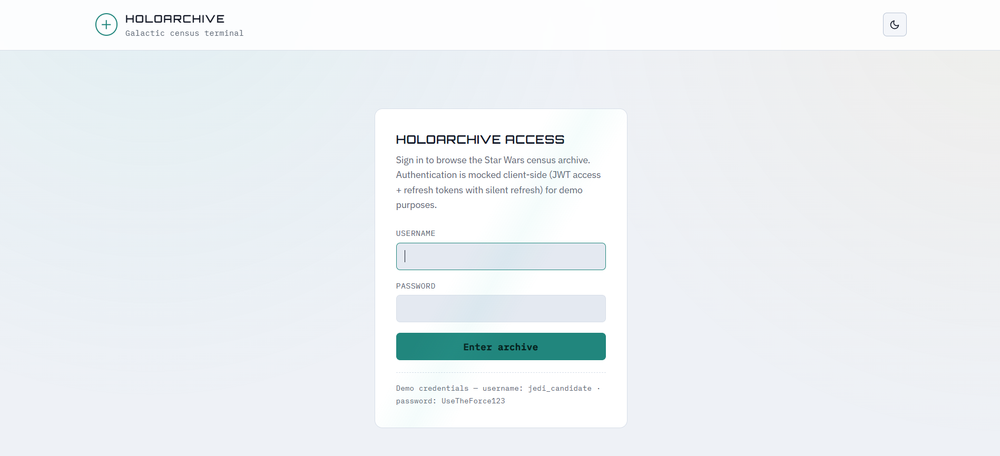
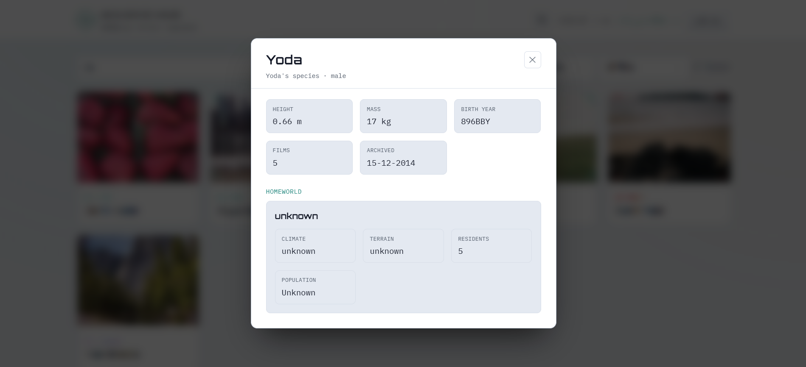

# ⭐ Star Wars Character Explorer

A modern and responsive Star Wars Character Explorer built with **React**, **TypeScript**, and **Tailwind CSS**. This application integrates with the Star Wars API (SWAPI) to display characters with pagination, search, filtering, detailed character information, homeworld data, loading/error states, and a clean, responsive UI.

---

## 🌐 Live Demo

**Live Application:** https://leafy-pie-464fee.netlify.app/

**GitHub Repository:** https://github.com/Anilmekala54/tsx-mern-06Aug2026

**Demo Video:** https://drive.google.com/file/d/1o-FQl7g3S9Ij6tuwu111KotbRuN6CFBF/view?usp=sharing

---

# 📸 Screenshots

> Save your screenshots inside the **screenshots/** folder.

### Login Page



### Home Page


### Character Details



### Mobile View


---

# ✨ Features

### Core Features

- Display Star Wars characters from the SWAPI
- Pagination
- Character cards with random images
- Species-based card colors
- Character details modal
- Homeworld information
- Loading skeletons
- Error handling with retry option
- Responsive design
- Light/Dark theme
- Smooth hover animations

---

### Bonus Features

- Search characters
- Filter by Species
- Filter by Homeworld
- Filter by Film
- Mock JWT Authentication
- Silent Token Refresh
- Integration Testing

---

# 🛠 Tech Stack

- React 19
- TypeScript
- Vite
- Tailwind CSS v4
- React Testing Library
- Vitest
- SWAPI (Star Wars API)
- Picsum Photos

---

# 🌐 API

Data Source

https://swapi.info/api/people

Additional Endpoints

- `/people`
- `/species`
- `/films`
- `/planets`

---

# 🚀 Installation

Clone the repository

```bash
git clone https://github.com/Anilmekala54/tsx-mern-06Aug2026.git
```

Go to project

```bash
cd swapi-app
```

Install dependencies

```bash
npm install
```

Run development server

```bash
npm run dev
```

Build project

```bash
npm run build
```

Run tests

```bash
npm run test
```

Preview production build

```bash
npm run preview
```

---

# 🔐 Demo Login


**Username**

```
jedi_candidate
```

**Password**

```
UseTheForce123
```

---

# 📂 Folder Structure

```text
src/
│── auth/
│── components/
│── hooks/
│── theme/
|── utils/
│── App.tsx
│── main.tsx
│── api.ts
│── App.test.tsx
│── App.tsx
│── index.css
│── setupTests.ts
│── types.ts
```

---

# ✅ Assignment Checklist

## Required Features

- [x] API Integration
- [x] Character Listing
- [x] Pagination
- [x] Loading State
- [x] Error State
- [x] Character Cards
- [x] Species-based Colors
- [x] Hover Animations
- [x] Character Details Modal
- [x] Homeworld Information
- [x] Responsive Design
- [x] TypeScript
- [x] Testing

---

## Optional Features

- [x] Search Characters
- [x] Filter by Species
- [x] Filter by Homeworld
- [x] Filter by Films
- [x] Mock JWT Authentication
- [x] Silent Refresh
- [x] Integration Test

---

# 🧪 Testing

Run the integration tests using

```bash
npm run test
```

The test verifies that:

- Login flow works correctly
- Character modal opens
- Correct character details are displayed
- Homeworld information is fetched successfully

---

# 📱 Responsive Design

The application is optimized for:

- Desktop
- Tablet
- Mobile

---

# 👨‍💻 Author

**Anil Mekala**

GitHub: https://github.com/Anilmekala54

LinkedIn: https://www.linkedin.com/in/anilinfo/

---

# 📄 License

This project was developed as part of the **TechStaX Frontend Developer (UI/UX) Assessment**.